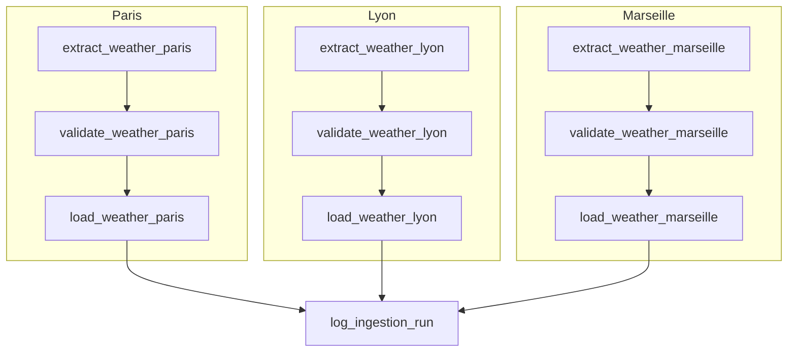

# TP2B Airflow : Ingestion Complète API → Transformation → PostgreSQL

## 1. Rôle des tâches et Structure du DAG (10 tâches)

Le DAG `tp2_simple_dag` a été étendu pour implémenter un flux ETL complet sur **3 villes** en parallèle, suivi d'une tâche d'audit :



### Description des rôles :
1. **`extract_weather_[ville]` (Extract)** : Interroge l'API Open-Meteo pour récupérer le JSON brut de la ville. C'est ici que la tâche est marquée comme *SKIPPED* si la ville n'est pas demandée en paramètre.
2. **`validate_weather_[ville]` (Transform)** : Reçoit le JSON brute, en extrait les indicateurs, décode les codes météo WMO, et valide les types et plages avec Pydantic (`WeatherData`).
3. **`load_weather_[ville]` (Load)** : Insère la ligne nettoyée et validée dans la table Postgres `weather_measures` via le `PostgresHook`.
4. **`log_ingestion_run` (Audit)** : Tâche finale exécutée systématiquement (`trigger_rule='all_done'`). Elle compile les villes correctement chargées, compte le nombre total de lignes insérées, et consigne ces métadonnées d'audit dans la table `ingestion_runs`.

---

## 2. Script SQL d'initialisation (`init_db.sql`)

Les tables SQL ont été créées sur l'instance PostgreSQL locale (port `54322`) avec le DDL suivant :

```sql
-- 1. Table de stockage des données de mesures météo (Propres et validées)
CREATE TABLE IF NOT EXISTS weather_measures (
    id SERIAL PRIMARY KEY,
    city VARCHAR(50) NOT NULL,
    temperature NUMERIC(4, 2) NOT NULL,
    conditions VARCHAR(100) NOT NULL,
    humidity INT NOT NULL,
    timestamp TIMESTAMP WITH TIME ZONE NOT NULL
);

-- 2. Table d'audit/suivi d'ingestion des exécutions du DAG
CREATE TABLE IF NOT EXISTS ingestion_runs (
    id SERIAL PRIMARY KEY,
    run_id VARCHAR(100) NOT NULL,
    execution_date TIMESTAMP WITH TIME ZONE NOT NULL,
    status VARCHAR(20) NOT NULL,
    cities_processed VARCHAR(255) NOT NULL,
    records_inserted INT NOT NULL,
    inserted_at TIMESTAMP WITH TIME ZONE DEFAULT CURRENT_TIMESTAMP NOT NULL
);
```

---

## 3. Paramétrage dynamique (Airflow Params)

Le DAG est paramétrable lors du déclenchement manuel :
* **Paramètre `cities`** : Liste de chaînes de caractères (clés des villes à traiter). Par défaut : `["paris", "lyon", "marseille"]`.
* **Mécanisme d'exclusion** : Si une ville est retirée de cette liste, la tâche d'extraction correspondante lève une exception `AirflowSkipException`. Airflow propage alors l'état *SKIPPED* sur toute sa branche (les tâches de validation et de chargement associées sont aussi sautées), évitant tout appel API ou écriture SQL inutile.

---

## 4. Preuve de chargement (SELECT SQL)

Pour valider le pipeline, nous avons effectué **trois exécutions de test** successives :
1. **Run 1 (Ligne de commande - Complet)** : Déclenchement par défaut (toutes les 3 villes sont traitées : Paris, Lyon, Marseille).
2. **Run 2 (Ligne de commande - Filtré)** : Déclenchement paramétré pour exclure Lyon (seules Paris et Marseille sont traitées).
3. **Run 3 (Interface Standalone Airflow - Complet)** : Déclenchement via l'interface web standalone d'Airflow (Paris, Lyon, Marseille).

Voici le contenu final extrait des tables PostgreSQL par requêtes `SELECT` après ces exécutions :

### Table des mesures météo (`weather_measures`)
```text
WEATHER MEASURES:
(1, 'Marseille', Decimal('22.70'), 'Clear sky', 61, datetime.datetime(2026, 6, 9, 12, 46, 30, 227288, tzinfo=datetime.timezone.utc))
(2, 'Lyon', Decimal('20.70'), 'Overcast', 52, datetime.datetime(2026, 6, 9, 12, 46, 31, 606885, tzinfo=datetime.timezone.utc))
(3, 'Paris', Decimal('19.00'), 'Mainly clear', 40, datetime.datetime(2026, 6, 9, 12, 46, 30, 889907, tzinfo=datetime.timezone.utc))
(4, 'Marseille', Decimal('22.70'), 'Clear sky', 61, datetime.datetime(2026, 6, 9, 12, 46, 53, 565407, tzinfo=datetime.timezone.utc))
(5, 'Paris', Decimal('19.00'), 'Mainly clear', 40, datetime.datetime(2026, 6, 9, 12, 46, 52, 742466, tzinfo=datetime.timezone.utc))
(6, 'Marseille', Decimal('22.70'), 'Clear sky', 61, datetime.datetime(2026, 6, 9, 12, 51, 15, 452352, tzinfo=datetime.timezone.utc))
(7, 'Lyon', Decimal('20.70'), 'Overcast', 52, datetime.datetime(2026, 6, 9, 12, 51, 16, 598131, tzinfo=datetime.timezone.utc))
(8, 'Paris', Decimal('19.00'), 'Mainly clear', 40, datetime.datetime(2026, 6, 9, 12, 51, 16, 597237, tzinfo=datetime.timezone.utc))
```
*Analyse : Les Runs 1 (IDs 1, 2, 3) et 3 (IDs 6, 7, 8) ont inséré toutes les 3 villes. Le Run 2 (IDs 4, 5) a correctement sauté Lyon.*

### Table de suivi d'ingestion (`ingestion_runs`)
```text
INGESTION RUNS:
(1, 'manual__2026-06-09T12:46:26.713881+00:00', datetime.datetime(2026, 6, 9, 12, 46, 26, 632211, tzinfo=datetime.timezone.utc), 'SUCCESS', 'Paris, Lyon, Marseille', 3, datetime.datetime(2026, 6, 9, 12, 46, 34, 736324, tzinfo=datetime.timezone.utc))
(2, 'manual__2026-06-09T12:46:49.190195+00:00', datetime.datetime(2026, 6, 9, 12, 46, 49, 118191, tzinfo=datetime.timezone.utc), 'SUCCESS', 'Paris, Marseille', 2, datetime.datetime(2026, 6, 9, 12, 46, 55, 712238, tzinfo=datetime.timezone.utc))
(3, 'manual__2026-06-09T12:51:10.775497+00:00', datetime.datetime(2026, 6, 9, 12, 51, 18, 608476, tzinfo=datetime.timezone.utc), 'SUCCESS', 'Paris, Lyon, Marseille', 3, datetime.datetime(2026, 6, 9, 12, 51, 18, 637679, tzinfo=datetime.timezone.utc))
```
*Analyse : L'audit montre les métadonnées pour chaque exécution. Le troisième run a bien été enregistré avec succès pour 3 villes.*

---

## 5. Captures d'écran de l'exécution

### Preuve d'exécution globale dans l'interface Airflow (3 branches en parallèle)


### Rapport et logs de la tâche de chargement PostgreSQL (load_weather_[ville])

