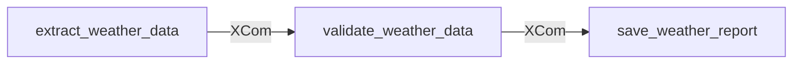
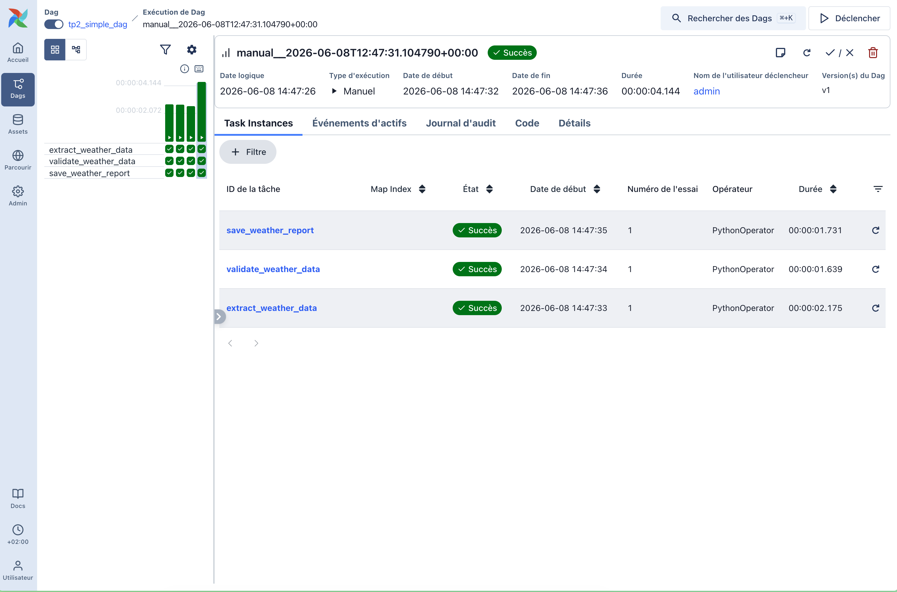
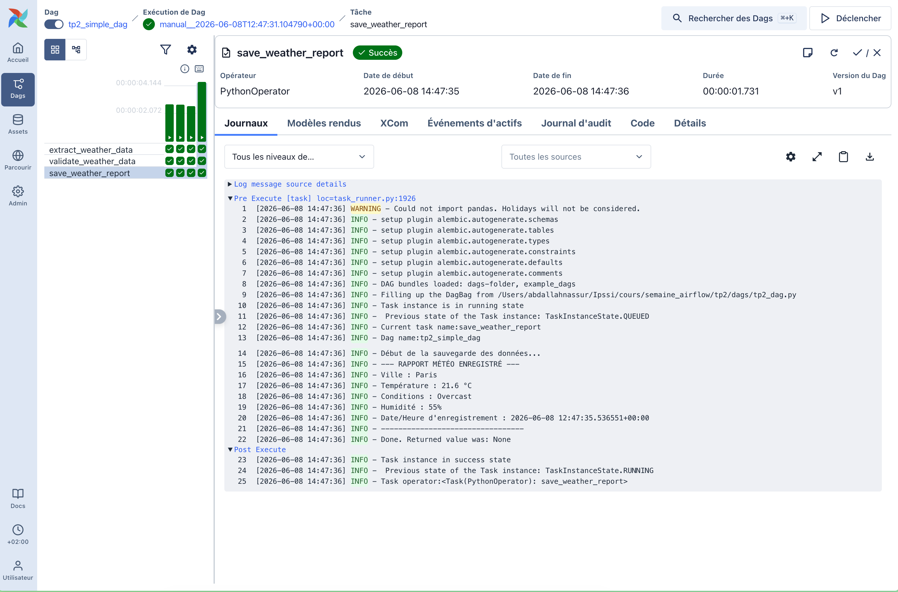

# TP2 Airflow : Création et Exécution d'un Premier DAG Simple

## 1. Rôle de chaque tâche créée

Le DAG `tp2_simple_dag` est composé de **3 tâches distinctes** définies de manière modulaire.

1. **`extract_weather_data` (Task ID: `extract_weather_data`)**
   * **Rôle** : Extraction des données météo de Paris.
   * **Fonctionnement** : Effectue un appel HTTP GET vers l'API publique Open-Meteo (Météo-France) : `https://api.open-meteo.com/v1/meteofrance`. Elle extrait la température, l'humidité relative, et le code météo actuel (WMO). Elle traduit ce code météo en condition textuelle lisible (ex: `3` -> `Overcast`) et retourne le dictionnaire brut de données à Airflow via les **XComs** sous la clé `return_value`.

2. **`validate_weather_data` (Task ID: `validate_weather_data`)**
   * **Rôle** : Validation de type et de structure du dictionnaire extrait.
   * **Fonctionnement** : Récupère les données brutes de la tâche précédente depuis XCom via `ti.xcom_pull`. Elle les injecte dans le schéma Pydantic `WeatherData` pour s'assurer de leur conformité. Si un champ manque ou est invalide, une exception est levée et la tâche échoue. Les données validées avec leur horodatage (UTC) sont ensuite retournées.

3. **`save_weather_report` (Task ID: `save_weather_report`)**
   * **Rôle** : Enregistrement/affichage du rapport météo final.
   * **Fonctionnement** : Récupère les données validées depuis l'étape précédente et produit un rapport formaté et propre dans la sortie standard et les logs d'Airflow.

---

## 2. Dépendances et structure du DAG

Les dépendances sont configurées en Python comme suit :
```python
task_extract >> task_validate >> task_save
```

Ce qui donne le graphe orienté acyclique (DAG) suivant :



---

## 3. Preuve d'exécution (Logs)

L'exécution du DAG a été réalisée avec succès en local via la commande `airflow dags test`. Voici l'extrait pertinent des logs montrant l'appel de l'API réelle et le traitement des données :

### Tâche 1 : `extract_weather_data`
```text
Task instance is in running state
Current task name:extract_weather_data
Dag name:tp2_simple_dag

Début de l'extraction des données météo via l'API Open-Meteo...
Données extraites avec succès depuis l'API : {'city': 'Paris', 'temperature': 20.8, 'conditions': 'Overcast', 'humidity': 61}
Done. Returned value was: {'city': 'Paris', 'temperature': 20.8, 'conditions': 'Overcast', 'humidity': 61}

Task instance in success state
```

### Tâche 2 : `validate_weather_data`
```text
Task instance is in running state
Current task name:validate_weather_data
Dag name:tp2_simple_dag

Début de la validation des données...
Validation réussie pour la ville : Paris
Done. Returned value was: {'city': 'Paris', 'temperature': 20.8, 'conditions': 'Overcast', 'humidity': 61, 'timestamp': datetime.datetime(2026, 6, 8, 10, 57, 6, 799269, tzinfo=datetime.timezone.utc)}

Task instance in success state
```

### Tâche 3 : `save_weather_report`
```text
Task instance is in running state
Current task name:save_weather_report
Dag name:tp2_simple_dag

Début de la sauvegarde des données...
--- RAPPORT MÉTÉO ENREGISTRÉ ---
Ville : Paris
Température : 20.8 °C
Conditions : Overcast
Humidité : 61%
Date/Heure d'enregistrement : 2026-06-08 10:57:06.799269+00:00
---------------------------------
Done. Returned value was: None

Task instance in success state
```

### Statut Final du DAG Run
```text
Marking run <DagRun tp2_simple_dag @ 2026-06-08: manual__..., state:running> successful
Dag run in success state
DagRun Finished: state=success, run_duration=2.560988
```

---

## 4. Captures d'écran de l'exécution

### Preuve d'exécution globale dans l'interface Airflow


### Rapport et logs de la tâche de sauvegarde (save_weather_report)

