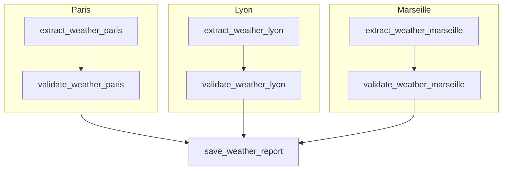
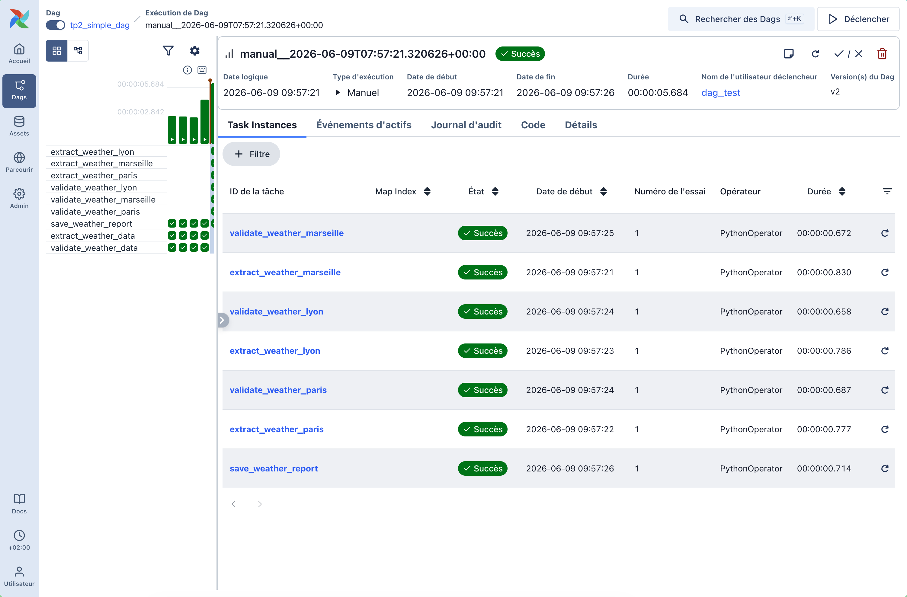
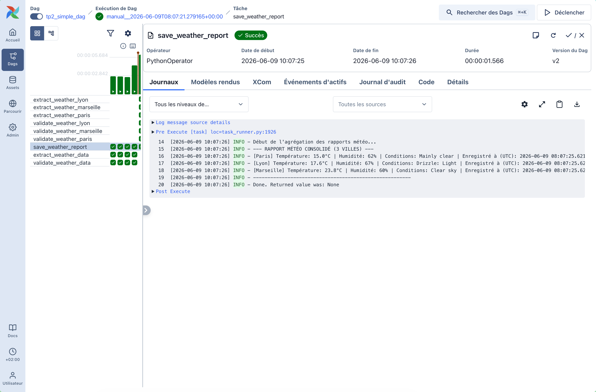

# TP2A Airflow : Préparation d'une Ingestion API Météo Multi-Villes

## 1. Rôle de chaque tâche et structure du DAG

Le DAG `tp2_simple_dag` traite en parallèle **3 villes** (Paris, Lyon, Marseille) pour séparer strictement l'extraction de la transformation :



### Description des Tâches :
1. **`extract_weather_[ville]`** (Tâche d'extraction brute) :
   * **Rôle** : Interroge l'API Open-Meteo pour récupérer les données en temps réel d'une ville spécifique via ses coordonnées géographiques.
   * **Données en sortie** : Retourne la réponse JSON brute de l'API (transmise par XCom).
2. **`validate_weather_[ville]`** (Tâche de transformation et validation) :
   * **Rôle** : Récupère la réponse JSON brute, en extrait les champs d'intérêt, effectue le décodage métier, valide les contraintes via le modèle Pydantic `WeatherData` et génère un dictionnaire structuré prêt à l'ingestion.
3. **`save_weather_report`** (Tâche de consolidation finale) :
   * **Rôle** : Récupère les données validées et nettoyées des 3 villes via XCom et affiche un rapport météo consolidé et propre.

---

## 2. Modèle de données & Justifications métiers

### A. Distinction des données
* **Données provenant directement de l'API (Données brutes)** :
  * `temperature_2m` (float) : Température mesurée à 2 mètres du sol.
  * `relative_humidity_2m` (int) : Humidité relative en pourcentage.
  * `weather_code` (int) : Code numérique WMO caractérisant la météo.
* **Données préparées pour le pipeline (Données enrichies)** :
  * `city` (str) : Nom de la ville (ajouté à l'étape de validation à partir de la configuration).
  * `conditions` (str) : Traduction textuelle humaine du code WMO (ex : code `3` -> `"Overcast"`, code `0` -> `"Clear sky"`).
  * `timestamp` (datetime) : Date et heure ISO (en UTC) à laquelle la donnée a été validée et ingérée.

### B. Justification des champs retenus (et des exclusions)
Dans le but de **"ne pas tout garder sans justification"**, nous trions les données reçues de l'API :
* **Champs Conservés (Besoin Métier)** :
  * La température et l'humidité sont les indicateurs climatiques directs indispensables pour une analyse météo.
  * Le code WMO converti en texte permet une lecture immédiate et simplifiée de l'état du ciel (pluie, soleil, nuageux).
  * Le nom de la ville et le timestamp d'ingestion permettent de partitionner et d'indexer correctement nos données historiques.
* **Champs Exclus (Sans valeur ajoutée métier immédiate)** :
  * *Altitude & Coordonnées (Latitude/Longitude)* : Déjà connues et statiques pour une ville donnée, les dupliquer dans chaque ligne de mesure de la table cible surchargerait inutilement le stockage.
  * *Interval (900s)* : Fréquence de rafraîchissement technique de l'API Open-Meteo, sans valeur métier pour les rapports.
  * *Unités (ex: `°C`, `%`)* : Statiques, elles doivent être définies dans la documentation de la table ou le type de colonne de la base de données, pas dans chaque enregistrement.
  * *Temps de génération de la requête (`generationtime_ms`)* : Métrique de performance technique propre à l'API Open-Meteo, sans intérêt pour le suivi de la météo.

### C. Cohérence avec la future table cible SQL
La structure produite par le schéma Pydantic `WeatherData` correspond parfaitement aux types de colonnes d'une table SQL relationnelle standard :
```sql
CREATE TABLE weather_measures (
    id SERIAL PRIMARY KEY,
    city VARCHAR(50) NOT NULL,
    temperature NUMERIC(4, 2) NOT NULL,
    conditions VARCHAR(100) NOT NULL,
    humidity INT CHECK (humidity >= 0 AND humidity <= 100) NOT NULL,
    timestamp TIMESTAMP WITH TIME ZONE DEFAULT CURRENT_TIMESTAMP NOT NULL
);
```

---

## 3. Preuve d'exécution (Logs réels)

L'exécution du DAG a été réalisée avec succès en local via la commande `airflow dags test`. Voici l'extrait pertinent des logs montrant le traitement et la consolidation finale :

### Tâche finale d'agrégation (`save_weather_report`)
```text
Task instance is in running state
Current task name:save_weather_report
Dag name:tp2_simple_dag

Début de l'agrégation des rapports météo...
--- RAPPORT MÉTÉO CONSOLIDÉ (3 VILLES) ---
[Paris] Température: 14.8°C | Humidité: 64% | Conditions: Mainly clear | Enregistré à (UTC): 2026-06-09 07:57:25.485210+00:00
[Lyon] Température: 17.3°C | Humidité: 69% | Conditions: Drizzle: Light | Enregistré à (UTC): 2026-06-09 07:57:24.763871+00:00
[Marseille] Température: 23.5°C | Humidité: 62% | Conditions: Clear sky | Enregistré à (UTC): 2026-06-09 07:57:26.187394+00:00
-------------------------------------------------------

Task instance in success state
Dag run in success state
DagRun Finished: state=success, run_duration=5.683649
```

---

## 4. Captures d'écran de l'exécution

### Preuve d'exécution globale dans l'interface Airflow (3 branches en parallèle)


### Rapport et logs de la tâche de sauvegarde consolidée (save_weather_report)

