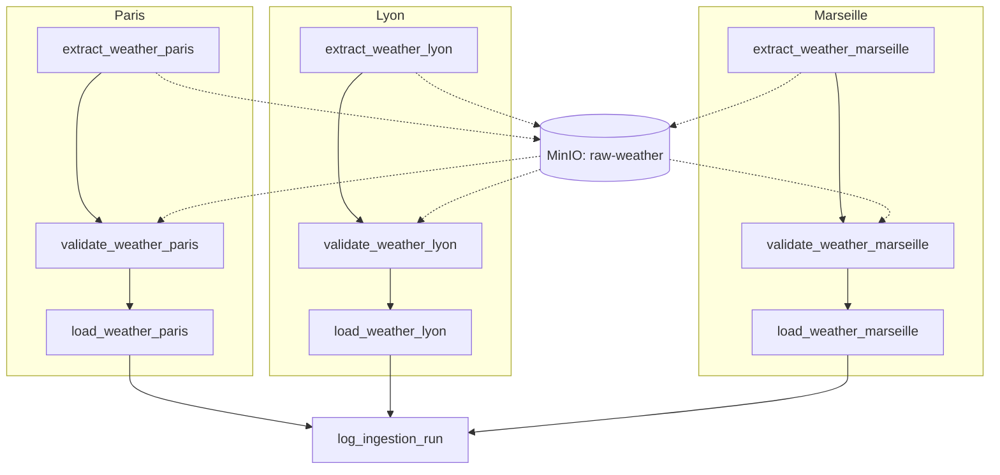
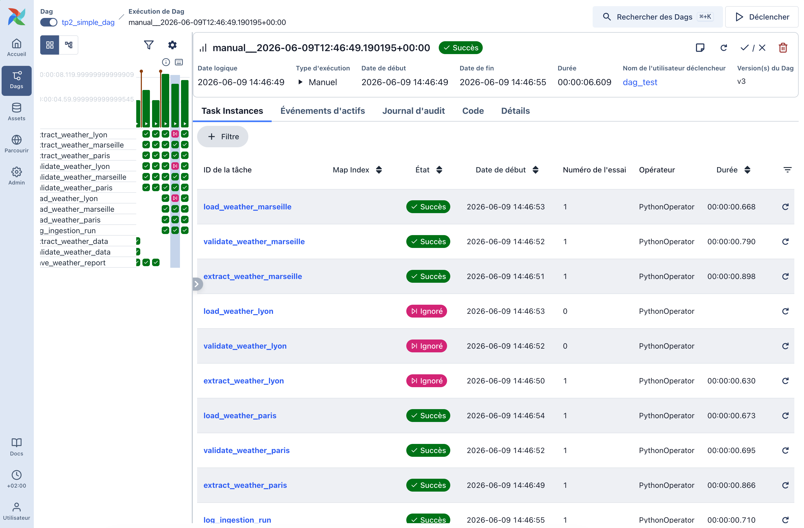
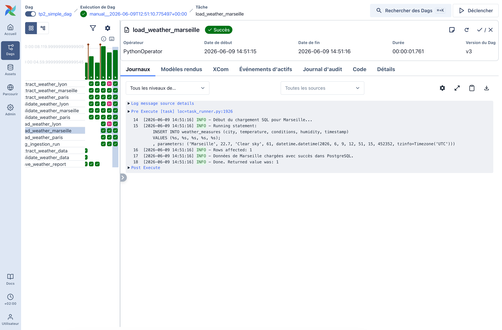
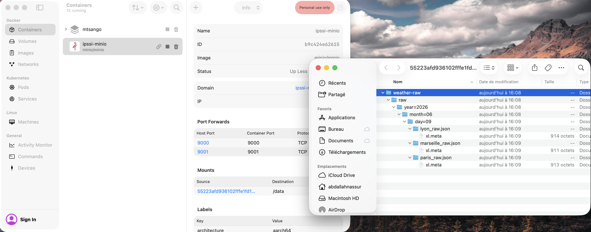
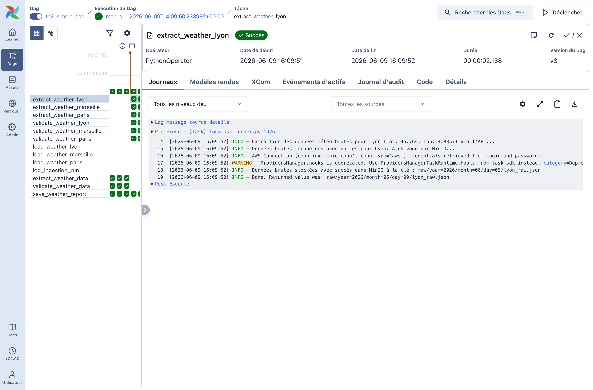

# TP2B Airflow : Ingestion Complète API → Transformation → PostgreSQL

## 1. Rôle des tâches et Structure du DAG (10 tâches avec MinIO)

Le DAG `tp2_simple_dag` implémente un flux ETL découplé utilisant **MinIO** comme stockage brut (Landing Zone) et **PostgreSQL** comme base de données cible :



### Description des rôles :
1. **`extract_weather_[ville]` (Extract & Store Raw)** : Interroge l'API Open-Meteo pour récupérer le JSON brut de la ville. Crée automatiquement le bucket `weather-raw` sur MinIO s'il n'existe pas, y charge le fichier JSON brut partitionné par date (`raw/year=YYYY/month=MM/day=DD/{city}_raw.json`), et retourne la clé S3 (via XCom).
2. **`validate_weather_[ville]` (Read Raw & Transform)** : Récupère la clé S3 via XCom, télécharge le fichier JSON brut correspondant depuis MinIO, décode les codes météo WMO, et valide les données avec le schéma Pydantic (`WeatherData`).
3. **`load_weather_[ville]` (Load to SQL)** : Insère la ligne nettoyée et validée dans la table Postgres `weather_measures` via le `PostgresHook`.
4. **`log_ingestion_run` (Audit)** : Tâche finale d'enregistrement d'audit (`trigger_rule='all_done'`). Elle compile les villes chargées, compte le nombre total de lignes insérées, et consigne ces métadonnées dans la table `ingestion_runs`.

---

## 2. Script SQL d'initialisation (`init_db.sql`)

Les tables SQL ont été créées sur l'instance PostgreSQL locale (port `54322`) avec le DDL suivant :

```sql
-- 1. Table de stockage des données de mesures météo (Propres et validées)
CREATE TABLE IF NOT EXISTS weather_measures (
    id SERIAL PRIMARY KEY,
    city VARCHAR(50) NOT NULL,
    temperature NUMERIC(4, 2) NOT NULL,
    conditions VARCHAR(100) NOT NULL,
    humidity INT NOT NULL,
    timestamp TIMESTAMP WITH TIME ZONE NOT NULL
);

-- 2. Table d'audit/suivi d'ingestion des exécutions du DAG
CREATE TABLE IF NOT EXISTS ingestion_runs (
    id SERIAL PRIMARY KEY,
    run_id VARCHAR(100) NOT NULL,
    execution_date TIMESTAMP WITH TIME ZONE NOT NULL,
    status VARCHAR(20) NOT NULL,
    cities_processed VARCHAR(255) NOT NULL,
    records_inserted INT NOT NULL,
    inserted_at TIMESTAMP WITH TIME ZONE DEFAULT CURRENT_TIMESTAMP NOT NULL
);
```

---

## 3. Stockage d'Objets MinIO (Landing Layer)

MinIO simule notre couche de stockage Cloud de type Data Lakehouse. Les fichiers y sont partitionnés temporellement selon le format Hive standard :
* **Bucket** : `weather-raw`
* **Chemin (Object Keys)** : `raw/year={YYYY}/month={MM}/day={DD}/{city_key}_raw.json`

---

## 4. Paramétrage dynamique (Airflow Params)

Le DAG est paramétrable lors du déclenchement manuel :
* **Paramètre `cities`** : Liste de chaînes de caractères (clés des villes à traiter). Par défaut : `["paris", "lyon", "marseille"]`.
* **Mécanisme d'exclusion** : Si une ville est retirée de cette liste, la tâche d'extraction correspondante lève une exception `AirflowSkipException`. Airflow propage alors l'état *SKIPPED* sur toute sa branche (les tâches de validation et de chargement associées sont aussi sautées), évitant tout appel API, stockage MinIO ou écriture SQL inutile.

---

## 5. Preuve de chargement (SELECT SQL et Objets MinIO)

Pour valider le pipeline complet avec MinIO et PostgreSQL, nous avons effectué des exécutions successives :
* **Run 4 (MinIO & Postgres - Avec concurrence de création de bucket)** : Déclenchement de la nouvelle architecture MinIO. Les créations de buckets en parallèle ont provoqué un conflit de création concurrentielle géré de manière robuste par un bloc try-except. Après retry automatique d'Airflow, le run a terminé en `SUCCESS` complet.
* **Run 5 (MinIO & Postgres - Succès direct)** : Deuxième déclenchement de la nouvelle architecture avec MinIO. Le run a réussi directement du premier coup.

### A. Objets stockés dans MinIO (Bucket `weather-raw`)
La commande de listing des objets montre les fichiers bruts correctement partitionnés créés sur notre stockage local MinIO :
```text
raw/year=2026/month=06/day=09/lyon_raw.json
raw/year=2026/month=06/day=09/marseille_raw.json
raw/year=2026/month=06/day=09/paris_raw.json
```

### B. Table des mesures météo (`weather_measures`)
```text
WEATHER MEASURES:
...
(9, 'Paris', Decimal('20.10'), 'Overcast', 36, datetime.datetime(2026, 6, 9, 14, 8, 36, 410011, tzinfo=datetime.timezone.utc))
(10, 'Marseille', Decimal('23.20'), 'Mainly clear', 60, datetime.datetime(2026, 6, 9, 14, 9, 37, 607927, tzinfo=datetime.timezone.utc))
(11, 'Lyon', Decimal('22.40'), 'Overcast', 39, datetime.datetime(2026, 6, 9, 14, 9, 37, 607952, tzinfo=datetime.timezone.utc))
(12, 'Paris', Decimal('20.10'), 'Overcast', 36, datetime.datetime(2026, 6, 9, 14, 9, 54, 684858, tzinfo=datetime.timezone.utc))
(13, 'Marseille', Decimal('23.20'), 'Mainly clear', 60, datetime.datetime(2026, 6, 9, 14, 9, 54, 684853, tzinfo=datetime.timezone.utc))
(14, 'Lyon', Decimal('22.40'), 'Overcast', 39, datetime.datetime(2026, 6, 9, 14, 9, 54, 684858, tzinfo=datetime.timezone.utc))
```
*Analyse : Les lignes 9 à 11 représentent le Run 4 (retries inclus), les lignes 12 à 14 représentent le Run 5.*

### C. Table de suivi d'ingestion (`ingestion_runs`)
```text
INGESTION RUNS:
...
(4, 'manual__2026-06-09T14:08:32.105328+00:00', datetime.datetime(2026, 6, 9, 14, 9, 39, 561817, tzinfo=datetime.timezone.utc), 'SUCCESS', 'Paris, Lyon, Marseille', 3, datetime.datetime(2026, 6, 9, 14, 9, 39, 588362, tzinfo=datetime.timezone.utc))
(5, 'manual__2026-06-09T14:09:50.233992+00:00', datetime.datetime(2026, 6, 9, 14, 9, 57, 362113, tzinfo=datetime.timezone.utc), 'SUCCESS', 'Paris, Lyon, Marseille', 3, datetime.datetime(2026, 6, 9, 14, 9, 57, 392713, tzinfo=datetime.timezone.utc))
```
*Analyse : Les audits confirment le succès complet pour les Runs 4 et 5 avec 3 enregistrements chargés à chaque fois.*

---

## 6. Captures d'écran de l'exécution

### Preuve d'exécution globale dans l'interface Airflow (3 branches en parallèle)


### Rapport et logs de la tâche de chargement PostgreSQL (load_weather_[ville])


### Console Web de MinIO (Listing des buckets)


### Fichiers JSON bruts stockés et partitionnés dans le bucket weather-raw

