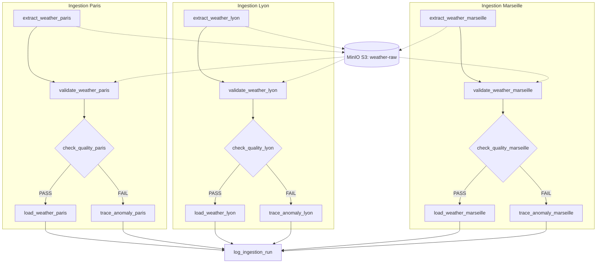
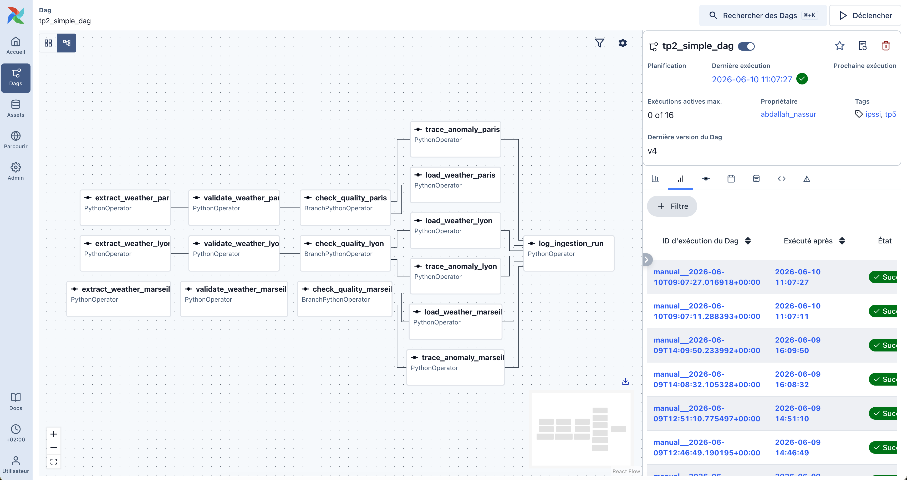
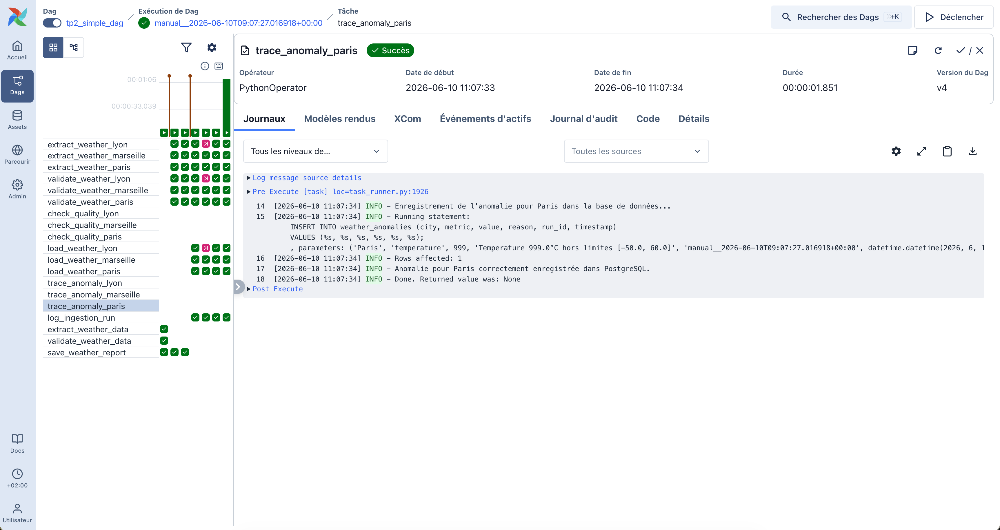

# TP5 : Industrialisation d'un Pipeline Airflow Open-Meteo

Version industrialisée et robuste du pipeline d'ingestion et de transformation de données météo utilisant **Apache Airflow**, **MinIO** (landing layer S3) et **PostgreSQL** (base de données cible).

---

## 1. Description du Pipeline & Schéma du Workflow

Le pipeline extrait les données météo de l'API Open-Meteo pour plusieurs villes configurables, archive les fichiers JSON bruts sur MinIO, valide la structure des données avec un schéma Pydantic, applique des contrôles de qualité dynamiques via des variables Airflow, et effectue un chargement conditionnel dans PostgreSQL :
* Si la qualité est **conforme (PASS)** : Insertion/mise à jour dans la table des mesures.
* Si la qualité est **défaillante (FAIL)** : Enregistrement de l'anomalie dans une table dédiée.

### Schéma Logique (16 tâches)



---

## 2. Variables & Connexions Airflow Utilisées

### Connexions
* **`minio_conn` (S3/AWS)** : Utilisée pour l'archivage brut des fichiers JSON.
  * *Type* : Amazon Web Services (`aws`)
  * *Login (Access Key)* : `minioadmin`
  * *Password (Secret Key)* : `minioadmin`
  * *Extra* : `{"endpoint_url": "http://localhost:9000"}`
* **`postgres_default` (PostgreSQL)** : Utilisée pour charger les données, insérer les anomalies, et enregistrer l'audit d'ingestion.
  * *Host* : `localhost`
  * *Port* : `54322`
  * *User / Password / Database* : `postgres` / `postgres` / `postgres`

### Variables de Contrôle Qualité (Dynamiques)
Ces variables contrôlent les seuils d'acceptabilité des données lors de l'exécution :
* `weather_temp_min` (défaut : `-50.0`) : Température minimale acceptable.
* `weather_temp_max` (défaut : `60.0`) : Température maximale acceptable.
* `weather_humidity_min` (défaut : `0`) : Pourcentage minimal d'humidité acceptable.
* `weather_humidity_max` (défaut : `100`) : Pourcentage maximal d'humidité acceptable.

---

## 3. Description des Tâches du DAG

Le DAG comporte **16 tâches au total** (5 par ville + 1 audit global) :
1. **`extract_weather_[ville]` (PythonOperator)** : Interroge l'API Open-Meteo, extrait le JSON brut et l'écrit sur MinIO sous la structure partitionnée Hive : `raw/year=YYYY/month=MM/day=DD/[ville]_raw.json`.
2. **`validate_weather_[ville]` (PythonOperator)** : Lit le JSON brut depuis MinIO, décode les codes météo WMO, et instancie un modèle Pydantic `WeatherData` en y injectant la date logique d'Airflow (`logical_date`) comme timestamp de référence.
3. **`check_quality_[ville]` (BranchPythonOperator)** : Récupère les seuils de qualité depuis les Variables Airflow. Compare les données physiques. Oriente le flux vers `load_weather_[ville]` si conforme, sinon vers `trace_anomaly_[ville]`.
4. **`load_weather_[ville]` (PythonOperator)** : Insère la mesure valide dans PostgreSQL avec une requête SQL d'Upsert (`ON CONFLICT`).
5. **`trace_anomaly_[ville]` (PythonOperator)** : Insère la métrique défaillante, la valeur aberrante, le motif d'échec et le run_id dans la table `weather_anomalies`.
6. **`log_ingestion_run` (PythonOperator)** : Tâche d'audit finale s'exécutant toujours (`trigger_rule='all_done'`). Elle agrège les résultats et consigne le statut global et le nombre d'enregistrements insérés dans `ingestion_runs`.

---

## 4. Stratégie de Robustesse, d'Idempotence et de Qualité

### Stratégie de Robustesse (Production SLA)
* **Retries & Delays** : En cas de défaillance réseau ou indisponibilité momentanée des API, chaque tâche tente **2 essais supplémentaires** (`retries: 2`) espacés de **15 secondes** (`retry_delay: timedelta(seconds=15)`).
* **Execution Timeout** : Afin de bloquer toute tâche suspendue indéfiniment (ex. requête API bloquée), un timeout strict de **45 secondes** est appliqué à chaque tâche.
* **Isolation d'Erreur** : Si l'une des branches de ville échoue (ex: échec API), seule cette branche s'arrête. Grâce à `trigger_rule='all_done'`, la tâche d'audit `log_ingestion_run` s'exécute quand même pour notifier/auditer le statut.

### Stratégie d'Idempotence (Zéro Doublon)
* **Date Logique comme Clé** : Plutôt que d'utiliser la date système du moment (`datetime.now()`), les données insérées se basent sur la date logique d'Airflow (`logical_date`). Ainsi, une relance de la même date produira le même timestamp.
* **Upsert Postgres** :
  * Dans `weather_measures`, une contrainte d'unicité `UNIQUE (city, timestamp)` empêche les doublons. L'insertion utilise la clause `ON CONFLICT (city, timestamp) DO UPDATE SET ...` pour mettre à jour la ligne en cas de relance.
  * Dans `ingestion_runs`, la contrainte `UNIQUE (run_id)` garantit qu'un run d'ingestion rejoué mettra à jour sa ligne d'audit plutôt que d'en insérer une nouvelle.

---

## 5. Description des Logs Produits

Pour assurer l'observabilité et faciliter le debugging en production, le pipeline produit des logs applicatifs structurés et verbeux à chaque étape clé :
1. **Logs d'Extraction (`extract_weather_[ville]`)** :
   - Affiche les coordonnées géographiques et l'appel API en cours.
   - Enregistre le succès de l'appel et la clé d'archivage sur MinIO (ex : `Données brutes stockées avec succès dans MinIO à la clé : raw/year=2026/month=06/day=10/paris_raw.json`).
2. **Logs de Validation (`validate_weather_[ville]`)** :
   - Affiche la récupération de la clé XCom et la lecture du JSON brute depuis MinIO.
   - Affiche le résultat de la transformation des codes météo WMO et le succès de l'instanciation Pydantic (ex : `Validation Pydantic réussie pour Paris.`).
3. **Logs de Qualité (`check_quality_[ville]`)** :
   - Indique la lecture dynamique des variables de seuils.
   - En cas de succès : `QUALITE SUCCES pour Paris (Temp: 16.0°C, Humidité: 58%)`.
   - En cas d'échec : `QUALITE ECHEC pour Paris : Temperature 999.0°C hors limites [-50.0, 60.0]` (avec redirection du flux).
4. **Logs de Traçage d'Anomalie (`trace_anomaly_[ville]`)** :
   - Confirme l'enregistrement de l'erreur dans la table dédiée (ex : `Anomalie pour Paris correctement enregistrée dans PostgreSQL.`).
5. **Logs de Chargement (`load_weather_[ville]`)** :
   - Affiche la mise à jour/insertion dans la table des mesures (ex : `Données de Paris chargées/mises à jour avec succès dans PostgreSQL.`).
6. **Logs d'Audit (`log_ingestion_run`)** :
   - Indique la compilation des indicateurs et l'écriture finale du statut (ex : `Audit d'ingestion enregistré/mis à jour avec succès : Run ID: manual__2026-06-10T09:07:27.016918+00:00 | Statut: SUCCESS | Lignes: 2`).

---

## 6. Description des Tables PostgreSQL

Le schéma de base de données défini dans `init_db.sql` est le suivant :

```sql
-- 1. Table des mesures (Données météo valides)
CREATE TABLE weather_measures (
    id SERIAL PRIMARY KEY,
    city VARCHAR(50) NOT NULL,
    temperature NUMERIC(4, 2) NOT NULL,
    conditions VARCHAR(100) NOT NULL,
    humidity INT NOT NULL,
    timestamp TIMESTAMP WITH TIME ZONE NOT NULL,
    CONSTRAINT unique_city_timestamp UNIQUE (city, timestamp)
);

-- 2. Table d'audit (Suivi d'ingestion globale)
CREATE TABLE ingestion_runs (
    id SERIAL PRIMARY KEY,
    run_id VARCHAR(100) NOT NULL,
    execution_date TIMESTAMP WITH TIME ZONE NOT NULL,
    status VARCHAR(20) NOT NULL,
    cities_processed VARCHAR(255) NOT NULL,
    records_inserted INT NOT NULL,
    inserted_at TIMESTAMP WITH TIME ZONE DEFAULT CURRENT_TIMESTAMP NOT NULL,
    CONSTRAINT unique_run_id UNIQUE (run_id)
);

-- 3. Table des anomalies (Suivi des rejets de qualité)
CREATE TABLE weather_anomalies (
    id SERIAL PRIMARY KEY,
    city VARCHAR(50) NOT NULL,
    metric VARCHAR(50) NOT NULL,
    value NUMERIC(6, 2) NOT NULL,
    reason VARCHAR(255) NOT NULL,
    run_id VARCHAR(100) NOT NULL,
    timestamp TIMESTAMP WITH TIME ZONE NOT NULL,
    inserted_at TIMESTAMP WITH TIME ZONE DEFAULT CURRENT_TIMESTAMP NOT NULL
);
```

---

## 7. Preuves d'Exécution & Résulats Réels

Le workflow complet avec la structure de branchement conditionnel en cas d'anomalie de qualité :


### A. Preuve de Cas Nominal (Tout est PASS)
Lors du déclenchement du DAG avec `simulate_anomaly: false`, toutes les mesures sont conformes aux seuils :
* **Ingestion Runs** :
  ```text
  (6, 'manual__2026-06-10T09:07:11.288393+00:00', datetime.datetime(2026, 6, 10, 9, 7, 18, tzinfo=timezone.utc), 'SUCCESS', 'Paris, Lyon, Marseille', 3, ...)
  ```
* **Mesures Météo** (3 enregistrements créés) :
  ```text
  (15, 'Marseille', Decimal('22.00'), 'Overcast', 39, datetime.datetime(2026, 6, 10, 9, 7, 15, tzinfo=timezone.utc))
  (16, 'Lyon', Decimal('19.10'), 'Overcast', 43, datetime.datetime(2026, 6, 10, 9, 7, 15, tzinfo=timezone.utc))
  (17, 'Paris', Decimal('16.00'), 'Overcast', 58, datetime.datetime(2026, 6, 10, 9, 7, 15, tzinfo=timezone.utc))
  ```

### B. Preuve de Cas d'Anomalie Qualité (FAIL sur Paris)
Lors du déclenchement avec `simulate_anomaly: true`, une température aberrante de `999.0°C` est injectée pour Paris :
* **Détection & Branchement** :
  * Paris a dévié vers `trace_anomaly_paris`. La tâche `load_weather_paris` a été passée sous silence (skipped).
  * Marseille et Lyon sont restés nominaux et ont été insérés.
* **Anomalie enregistrée** dans `weather_anomalies` :
  ```text
  (1, 'Paris', 'temperature', Decimal('999.00'), 'Temperature 999.0°C hors limites [-50.0, 60.0]', 'manual__2026-06-10T09:07:27.016918+00:00', ...)
  ```
* **Ingestion Runs** (Seuls Lyon et Marseille sont traités) :
  ```text
  (7, 'manual__2026-06-10T09:07:27.016918+00:00', ..., 'SUCCESS', 'Lyon, Marseille', 2, ...)
  ```

Le graphe d'exécution Airflow illustrant la déviation vers la tâche `trace_anomaly_paris` et la tâche `load_weather_paris` ignorée (en rose / rose clair) :


### C. Preuve d'Idempotence (Relance des Tâches)
J'ai utilisé la commande `airflow tasks clear` pour réexécuter l'ensemble des tâches exécutées aujourd'hui.
* **Résultat des Comptes** :
  * Nombre total d'ingestions : **7** (exactement inchangé)
  * Nombre total de mesures : **19** (exactement inchangé)
  * Nombre total d'anomalies : **1** (exactement inchangé)
  * Les lignes existantes ont été écrasées avec succès par la clause `ON CONFLICT DO UPDATE`, sans aucune duplication.

---

## 8. Limites éventuelles du travail rendu

* **Villes en dur dans le code** : La structure des tâches par ville (extract -> validate -> check -> load/trace) est générée dynamiquement au chargement du DAG à partir du dictionnaire local `CITIES`. Si une nouvelle ville est ajoutée en cours d'exécution, Airflow doit recharger le fichier DAG pour mettre à jour la structure du graphe.
* **Gestion des seuils au niveau global** : Les seuils de température et d'humidité sont définis de manière globale via des variables Airflow (les mêmes seuils s'appliquent à Paris et à Marseille). Pour aller plus loin, on pourrait stocker ces seuils par ville dans une configuration JSON pour adapter les seuils aux climats spécifiques de chaque région.
